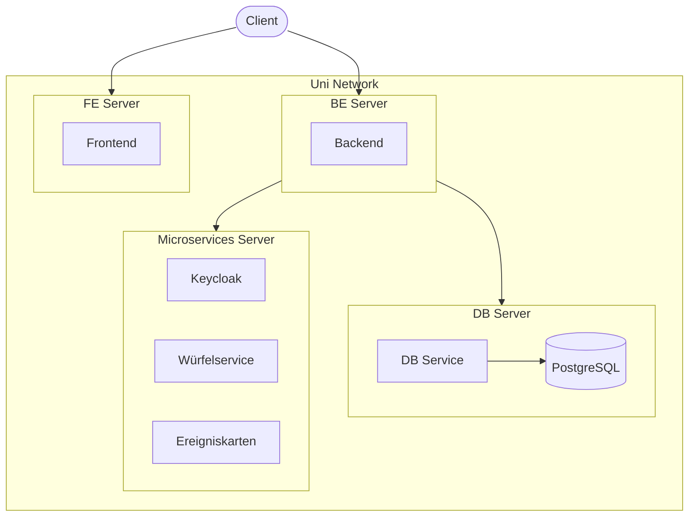

```mermaid
graph TD    
    subgraph Uni Network

        subgraph Backend_Server [BE Server]
            Backend_Instance[Backend]
        end

        subgraph Frontend_Server [FE Server]
            Frontend_Service[Frontend]
        end

        subgraph Database_Server [DB Server]
            Database_Service[DB Service]
            Database[(PostgreSQL)]
        end

        subgraph Microservices_Server [Microservices Server]
            Keycloak
            Würfelservice
            Ereigniskarten
        end
    end
    
    Client([Client]) --> Backend_Server


    Backend_Server --> Database_Server

    Backend_Server -->Microservices_Server
    Database_Service --> Database

    Client --> Frontend_Server
```