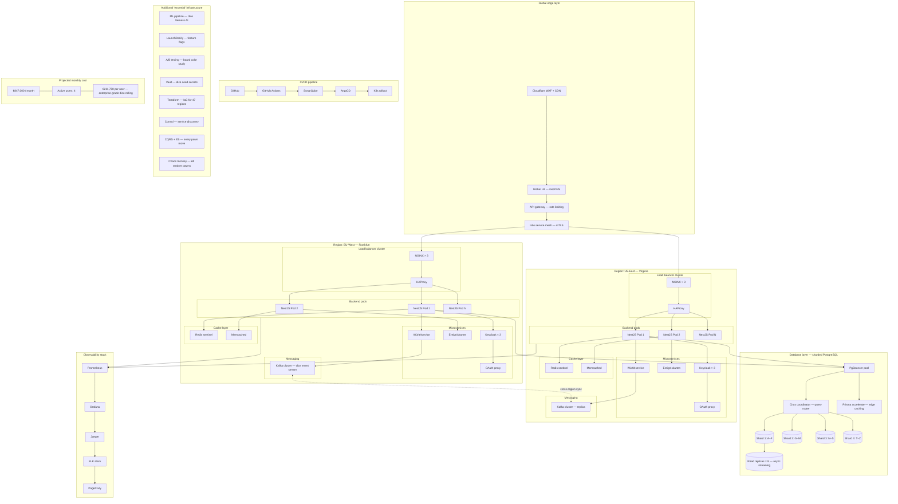

```mermaid
graph TD
subgraph Global_Edge_Layer [Global edge layer]
Cloudflare[Cloudflare WAF + CDN]
GlobalLB[Global LB — GeoDNS]
APIGateway[API gateway — rate limiting]
ServiceMesh[Istio service mesh — mTLS]

Cloudflare --> GlobalLB --> APIGateway --> ServiceMesh
end

subgraph EU_West [Region: EU-West — Frankfurt]
subgraph EU_LB [Load balancer cluster]
EU_NGINX[NGINX × 3]
EU_HAProxy[HAProxy]
EU_NGINX --> EU_HAProxy
end

subgraph EU_Backend [Backend pods]
EU_Pod1[NestJS Pod 1]
EU_Pod2[NestJS Pod 2]
EU_PodN[NestJS Pod N]
end

subgraph EU_Microservices [Microservices]
EU_Wuerfel[Würfelservice]
EU_Ereignis[Ereigniskarten]
EU_Keycloak[Keycloak × 3]
EU_OAuth[OAuth proxy]
end

subgraph EU_Messaging [Messaging]
EU_Kafka[Kafka cluster — dice event stream]
end

subgraph EU_Cache [Cache layer]
EU_Redis[Redis sentinel]
EU_Memcached[Memcached]
end

EU_HAProxy --> EU_Pod1
EU_HAProxy --> EU_Pod2
EU_HAProxy --> EU_PodN

EU_Pod1 --> EU_Wuerfel
EU_Pod2 --> EU_Ereignis
EU_Pod1 --> EU_Keycloak
EU_Keycloak --> EU_OAuth

EU_Wuerfel --> EU_Kafka
EU_Pod1 --> EU_Redis
EU_Pod2 --> EU_Memcached
end

subgraph US_East [Region: US-East — Virginia]
subgraph US_LB [Load balancer cluster]
US_NGINX[NGINX × 3]
US_HAProxy[HAProxy]
US_NGINX --> US_HAProxy
end

subgraph US_Backend [Backend pods]
US_Pod1[NestJS Pod 1]
US_Pod2[NestJS Pod 2]
US_PodN[NestJS Pod N]
end

subgraph US_Microservices [Microservices]
US_Wuerfel[Würfelservice]
US_Ereignis[Ereigniskarten]
US_Keycloak[Keycloak × 3]
US_OAuth[OAuth proxy]
end

subgraph US_Messaging [Messaging]
US_Kafka[Kafka cluster — replica]
end

subgraph US_Cache [Cache layer]
US_Redis[Redis sentinel]
US_Memcached[Memcached]
end

US_HAProxy --> US_Pod1
US_HAProxy --> US_Pod2
US_HAProxy --> US_PodN

US_Pod1 --> US_Wuerfel
US_Pod2 --> US_Ereignis
US_Pod1 --> US_Keycloak
US_Keycloak --> US_OAuth

US_Wuerfel --> US_Kafka
US_Pod1 --> US_Redis
US_Pod2 --> US_Memcached
end

subgraph DB_Layer [Database layer — sharded PostgreSQL]
Citus[Citus coordinator — query router]
Shard1[(Shard 1: A–F)]
Shard2[(Shard 2: G–M)]
Shard3[(Shard 3: N–S)]
Shard4[(Shard 4: T–Z)]
ReadReplicas[(Read replicas × 8 — async streaming)]
PgBouncer[PgBouncer pool]
PrismaAccelerate[Prisma accelerate — edge caching]

Citus --> Shard1
Citus --> Shard2
Citus --> Shard3
Citus --> Shard4
Shard1 --> ReadReplicas
PgBouncer --> PrismaAccelerate
PgBouncer --> Citus
end

subgraph Observability [Observability stack]
Prometheus --> Grafana
Grafana --> Jaeger
Jaeger --> ELK[ELK stack]
ELK --> PagerDuty
end

subgraph CICD [CI/CD pipeline]
GitHub --> Actions[GitHub Actions]
Actions --> SonarQube
SonarQube --> ArgoCD
ArgoCD --> K8sRollout[K8s rollout]
end

subgraph Overkill [Additional 'essential' infrastructure]
MLPipeline[ML pipeline — dice fairness AI]
FeatureFlags[LaunchDarkly — feature flags]
ABTesting[A/B testing — board color study]
Vault[Vault — dice seed secrets]
Terraform[Terraform — IaC for 47 regions]
Consul[Consul — service discovery]
CQRS[CQRS + ES — every pawn move]
ChaosMonkey[Chaos monkey — kill random pawns]
end

subgraph Cost [Projected monthly cost]
MonthlyCost[€847,000 / month]
ActiveUsers[Active users: 4]
PerUser[€211,750 per user — enterprise-grade dice rolling]
MonthlyCost --- ActiveUsers --- PerUser
end

ServiceMesh --> EU_NGINX
ServiceMesh --> US_NGINX

EU_Kafka <-.->|cross-region sync| US_Kafka

EU_Pod1 --> PgBouncer
US_Pod1 --> PgBouncer

EU_Backend --> Prometheus
US_Backend --> Prometheus
```