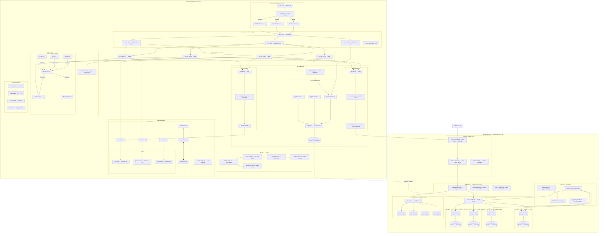

```mermaid
graph TD
    subgraph EU_West [Region: EU-West — Frankfurt]

        subgraph NGINX_Cluster [NGINX load balancer cluster]
            NGINX1[NGINX instance 1]
            NGINX2[NGINX instance 2]
            NGINX3[NGINX instance 3]
            Keepalived[Keepalived — VRRP failover]
            VIP[Virtual IP — 10.0.0.100]

            VIP --> Keepalived
            Keepalived -->|active| NGINX1
            Keepalived -->|standby| NGINX2
            Keepalived -->|standby| NGINX3
        end

        subgraph NGINX1_Detail [NGINX 1 — active]
            N1_Listen[Listen :443 — TLS termination]
            N1_RateLimit[Rate limiting — 1000 req/s per IP]
            N1_Upstream[Upstream pool — least_conn]
            N1_Health[Health checks — /health every 5s]
            N1_Cache[Response cache — static assets]

            N1_Listen --> N1_RateLimit --> N1_Upstream
            N1_Upstream --> N1_Health
            N1_Listen --> N1_Cache
        end

        subgraph HAProxy_Layer [HAProxy — L4/L7 routing]
            HAProxy_Frontend[Frontend — bind :8080]
            HAProxy_ACL_REST[ACL: /api/* → backend pool]
            HAProxy_ACL_WS[ACL: /ws/* → WebSocket pool]
            HAProxy_ACL_Auth[ACL: /auth/* → Keycloak pool]
            HAProxy_Stats[Stats dashboard :9000]

            HAProxy_Frontend --> HAProxy_ACL_REST
            HAProxy_Frontend --> HAProxy_ACL_WS
            HAProxy_Frontend --> HAProxy_ACL_Auth
        end

        subgraph Backend_Pool [Backend pods — NestJS]
            Pod1[NestJS Pod 1 — :3000]
            Pod2[NestJS Pod 2 — :3000]
            Pod3[NestJS Pod 3 — :3000]
            PodN[NestJS Pod N — :3000]

            
        end

        subgraph Microservices [Microservices]
            subgraph Wuerfel [Würfelservice]
                W_API[REST API — :3001]
                W_RNG[Crypto RNG — dice generation]
                W_Validate[Result validator]
                W_API --> W_RNG --> W_Validate
            end

            subgraph Ereignis [Ereigniskarten]
                E_API[REST API — :3002]
                E_Deck[Deck manager — shuffle + draw]
                E_Effects[Effect resolver — game state mutations]
                E_API --> E_Deck --> E_Effects
            end

            subgraph Keycloak_Cluster [Keycloak HA cluster]
                KC1[Keycloak node 1]
                KC2[Keycloak node 2]
                KC3[Keycloak node 3]
                KC_Infinispan[Infinispan — session cache]
                KC_DB[(Keycloak PostgreSQL)]

                KC1 --> KC_Infinispan
                KC2 --> KC_Infinispan
                KC3 --> KC_Infinispan
                KC_Infinispan --> KC_DB
            end

            OAuthProxy[OAuth2 proxy — token validation]
        end

        subgraph Messaging [Event streaming]
            subgraph Kafka_Cluster [Kafka cluster]
                Broker1[Broker 1]
                Broker2[Broker 2]
                Broker3[Broker 3]
                ZK1[ZooKeeper 1]
                ZK2[ZooKeeper 2]
                ZK3[ZooKeeper 3]

                ZK1 <--> ZK2 <--> ZK3

                subgraph Topics [Topics]
                    T_Dice[dice.rolls — partitions: 12]
                    T_Moves[game.moves — partitions: 12]
                    T_Events[game.events — partitions: 6]
                end

                Broker1 --> T_Dice
                Broker2 --> T_Moves
                Broker3 --> T_Events
            end

            SchemaRegistry[Schema registry — Avro schemas]
        end

        subgraph Cache_Layer [Cache layer]
            subgraph Redis_Sentinel [Redis sentinel cluster]
                Redis_Master[Redis master]
                Redis_Replica1[Redis replica 1]
                Redis_Replica2[Redis replica 2]
                Sentinel1[Sentinel 1]
                Sentinel2[Sentinel 2]
                Sentinel3[Sentinel 3]

                Sentinel1 -->|monitors| Redis_Master
                Sentinel2 -->|monitors| Redis_Master
                Sentinel3 -->|monitors| Redis_Master
                Redis_Master -->|replicates| Redis_Replica1
                Redis_Master -->|replicates| Redis_Replica2
            end

            subgraph Redis_Usage [Redis key spaces]
                Sessions[sessions:* — TTL 24h]
                GameState[gamestate:* — TTL 1h]
                Leaderboard[leaderboard — sorted set]
                RateLimit[ratelimit:* — sliding window]
            end

            Memcached[Memcached — query result cache]
        end

        %% Connections within EU-West
        NGINX1 --> HAProxy_Frontend
        NGINX2 --> HAProxy_Frontend
        NGINX3 --> HAProxy_Frontend

        HAProxy_ACL_REST --> Pod1
        HAProxy_ACL_REST --> Pod2
        HAProxy_ACL_REST --> Pod3
        HAProxy_ACL_REST --> PodN
        HAProxy_ACL_WS --> Pod1
        HAProxy_ACL_WS --> Pod2
        HAProxy_ACL_Auth --> KC1

        Pod1 --> W_API
        Pod2 --> W_API
        Pod1 --> E_API
        Pod3 --> E_API
        Pod1 --> OAuthProxy
        OAuthProxy --> KC1

        Pod1 --> Broker1
        Pod2 --> Broker2
        W_Validate --> Broker1

        Pod1 --> Redis_Master
        Pod2 --> Redis_Replica1
        Pod3 --> Memcached
    end

    subgraph DB_Layer [Database layer — sharded PostgreSQL]
        subgraph PgBouncer_Pool [PgBouncer — connection pooling]
            PgB_Transaction[Transaction mode — pool_size: 100]
            PgB_Auth[Auth passthrough — scram-sha-256]
            PgB_Stats[Stats — pgbouncer SHOW commands]
        end

        subgraph Citus_Cluster [Citus distributed PostgreSQL]
            Coordinator[Citus coordinator — query router]

            subgraph Shard_1 [Shard 1 — game_id hash 0–16383]
                S1_Primary[(Primary — 5432)]
                S1_Replica[(Replica — streaming)]
                S1_Primary --> S1_Replica
            end

            subgraph Shard_2 [Shard 2 — game_id hash 16384–32767]
                S2_Primary[(Primary — 5432)]
                S2_Replica[(Replica — streaming)]
                S2_Primary --> S2_Replica
            end

            subgraph Shard_3 [Shard 3 — game_id hash 32768–49151]
                S3_Primary[(Primary — 5432)]
                S3_Replica[(Replica — streaming)]
                S3_Primary --> S3_Replica
            end

            subgraph Shard_4 [Shard 4 — game_id hash 49152–65535]
                S4_Primary[(Primary — 5432)]
                S4_Replica[(Replica — streaming)]
                S4_Primary --> S4_Replica
            end

            Coordinator --> S1_Primary
            Coordinator --> S2_Primary
            Coordinator --> S3_Primary
            Coordinator --> S4_Primary
        end

        subgraph Read_Layer [Read replicas — query routing]
            ReadPool[Read pool — round robin]
            R1[(Read replica 1)]
            R2[(Read replica 2)]
            R3[(Read replica 3)]
            R4[(Read replica 4)]

            ReadPool --> R1
            ReadPool --> R2
            ReadPool --> R3
            ReadPool --> R4
        end

        subgraph Prisma_Layer [Prisma — ORM layer]
            PrismaAccelerate[Prisma accelerate — edge query cache]
            PrismaMigrate[Prisma migrate — schema versioning]
            PrismaMiddleware[Prisma middleware — soft delete + audit log]
        end

        subgraph DB_Ops [Database operations]
            WAL[WAL archiving — pg_basebackup]
            PITR[Point-in-time recovery]
            Patroni[Patroni — HA orchestration]
            PgStat[pg_stat_statements — query analysis]

            WAL --> PITR
            Patroni --> Coordinator
            Patroni --> S1_Primary
            Patroni --> S2_Primary
        end

        %% DB internal connections
        PgB_Transaction --> Coordinator
        PgB_Transaction --> ReadPool
        PrismaAccelerate --> PgB_Transaction
        PrismaMiddleware --> PrismaAccelerate
    end

    %% Cross-layer connections
    PrismaClient --> PrismaMiddleware
    E_Effects --> PrismaMiddleware
    KC_DB -.->|separate instance| Coordinator
```